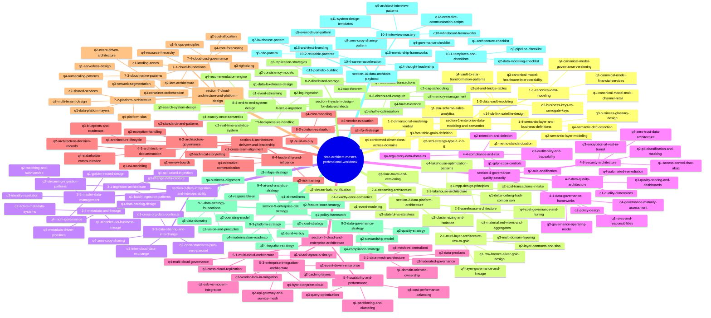

```mermaid
mindmap
  root((data-architect-master-professional-workbook))

    section-1-enterprise-data-modeling-and-semantics
      1-1-canonical-data-modeling
        q1-canonical-model-multi-channel-retail
        q2-canonical-model-financial-services
        q3-canonical-model-healthcare-interoperability
        q4-canonical-model-governance-versioning
      1-2-dimensional-modeling-kimball
        q1-star-schema-sales-analytics
        q2-scd-strategy-type-1-2-3-6
        q3-fact-table-grain-definition
        q4-conformed-dimensions-across-domains
      1-3-data-vault-modeling
        q1-hub-link-satellite-design
        q2-business-keys-vs-surrogate-keys
        q3-pit-and-bridge-tables
        q4-vault-to-star-transformation-patterns
      1-4-semantic-layer-and-business-definitions
        q1-metric-standardization
        q2-semantic-layer-modeling
        q3-business-glossary-design
        q4-semantic-drift-detection

    section-2-data-platform-architecture
      2-1-multi-layer-architecture-raw-to-gold
        q1-raw-bronze-silver-gold-design
        q2-layer-contracts-and-slas
        q3-multi-domain-layering
        q4-layer-governance-and-lineage
      2-2-lakehouse-architecture
        q1-delta-iceberg-hudi-comparison
        q2-acid-transactions-in-lake
        q3-time-travel-and-versioning
        q4-lakehouse-optimization-patterns
      2-3-warehouse-architecture
        q1-mpp-design-principles
        q2-cluster-sizing-and-isolation
        q3-materialized-views-and-aggregates
        q4-cost-governance-and-tuning
      2-4-streaming-architecture
        q1-event-modeling
        q2-stream-batch-unification
        q3-stateful-vs-stateless
        q4-exactly-once-semantics

    section-3-data-integration-and-interoperability
      3-1-ingestion-architecture
        q1-batch-ingestion-patterns
        q2-streaming-ingestion-patterns
        q3-change-data-capture
        q4-api-based-ingestion
      3-2-master-data-management
        q1-golden-record-design
        q2-matching-and-survivorship
        q3-identity-resolution
        q4-mdm-governance
      3-3-data-sharing-and-interchange
        q1-cross-org-data-contracts
        q2-open-standards-json-avro-parquet
        q3-inter-cloud-data-exchange
        q4-zero-copy-sharing
      3-4-metadata-and-lineage
        q1-technical-vs-business-lineage
        q2-active-metadata-systems
        q3-data-catalog-design
        q4-metadata-driven-pipelines

    section-4-governance-quality-security
      4-1-data-governance-frameworks
        q1-roles-and-responsibilities
        q2-policy-design
        q3-governance-operating-model
        q4-governance-maturity-assessment
      4-2-data-quality-architecture
        q1-quality-dimensions
        q2-rule-codification
        q3-quality-scoring-and-dashboards
        q4-automated-remediation
      4-3-security-architecture
        q1-access-control-rbac-abac
        q2-pii-classification-and-masking
        q3-encryption-at-rest-in-transit
        q4-zero-trust-data-architecture
      4-4-compliance-and-risk
        q1-gdpr-ccpa-controls
        q2-retention-and-deletion
        q3-auditability-and-traceability
        q4-regulatory-data-domains

    section-5-cloud-and-enterprise-architecture
      5-1-multi-cloud-architecture
        q1-cloud-agnostic-design
        q2-cross-cloud-replication
        q3-vendor-lock-in-mitigation
        q4-multi-cloud-governance
      5-2-data-mesh-architecture
        q1-domain-oriented-ownership
        q2-data-products
        q3-federated-governance
        q4-mesh-vs-centralized
      5-3-enterprise-integration-architecture
        q1-event-driven-enterprise
        q2-api-gateway-and-service-mesh
        q3-esb-vs-modern-integration
        q4-hybrid-onprem-cloud
      5-4-scalability-and-performance
        q1-partitioning-and-clustering
        q2-caching-layers
        q3-query-optimization
        q4-cost-performance-balancing

    section-6-architecture-delivery-and-leadership
      6-1-architecture-documentation
        q1-c4-modeling
        q2-architecture-decision-records
        q3-blueprints-and-roadmaps
        q4-stakeholder-communication
      6-2-architecture-governance
        q1-review-boards
        q2-standards-and-patterns
        q3-exception-handling
        q4-architecture-lifecycle
      6-3-solution-evaluation
        q1-build-vs-buy
        q2-vendor-evaluation
        q3-rfp-rfi-design
        q4-cost-modeling
      6-4-leadership-and-influence
        q1-cross-team-alignment
        q2-technical-storytelling
        q3-risk-framing
        q4-executive-communication

    section-7-cloud-architecture-and-platform-design
      7-1-cloud-foundations
        q1-landing-zones
        q2-iam-architecture
        q3-network-segmentation
        q4-resource-hierarchy
      7-2-platform-architecture
        q1-data-platform-layers
        q2-shared-services
        q3-multi-tenant-design
        q4-platform-slas
      7-3-cloud-native-patterns
        q1-serverless-design
        q2-event-driven-architecture
        q3-container-orchestration
        q4-autoscaling-patterns
      7-4-cloud-cost-governance
        q1-finops-principles
        q2-cost-allocation
        q3-rightsizing
        q4-cost-forecasting

    section-8-system-design-for-data-architects
      8-1-high-scale-ingestion
        q1-event-streaming
        q2-log-ingestion
        q3-backpressure-handling
        q4-exactly-once-semantics
      8-2-distributed-storage
        q1-cap-theorem
        q2-consistency-models
        q3-replication-strategies
        q4-distributed-transactions
      8-3-distributed-compute
        q1-shuffle-optimization
        q2-dag-scheduling
        q3-memory-management
        q4-fault-tolerance
      8-4-end-to-end-system-design
        q1-data-lakehouse-design
        q2-real-time-analytics-system
        q3-search-system-design
        q4-recommendation-engine

    section-9-enterprise-data-strategy
      9-1-data-strategy-foundations
        q1-vision-and-principles
        q2-operating-model
        q3-data-domains
        q4-business-alignment
      9-2-data-governance-strategy
        q1-policy-framework
        q2-stewardship-model
        q3-quality-strategy
        q4-compliance-strategy
      9-3-platform-strategy
        q1-build-vs-buy
        q2-cloud-strategy
        q3-integration-strategy
        q4-modernization-roadmap
      9-4-ai-and-analytics-strategy
        q1-ai-readiness
        q2-feature-store-strategy
        q3-mlops-strategy
        q4-responsible-ai

    section-10-data-architect-playbook
      10-1-templates-and-checklists
        q1-architecture-checklist
        q2-data-modeling-checklist
        q3-pipeline-checklist
        q4-governance-checklist
      10-2-reusable-patterns
        q5-event-driven-pattern
        q6-cdc-pattern
        q7-lakehouse-pattern
        q8-zero-copy-sharing-pattern
      10-3-interview-mastery
        q9-architect-interview-patterns
        q10-whiteboard-frameworks
        q11-system-design-templates
        q12-executive-communication-scripts
      10-4-career-acceleration
        q13-portfolio-building
        q14-thought-leadership
        q15-mentorship-frameworks
        q16-architect-branding
```
